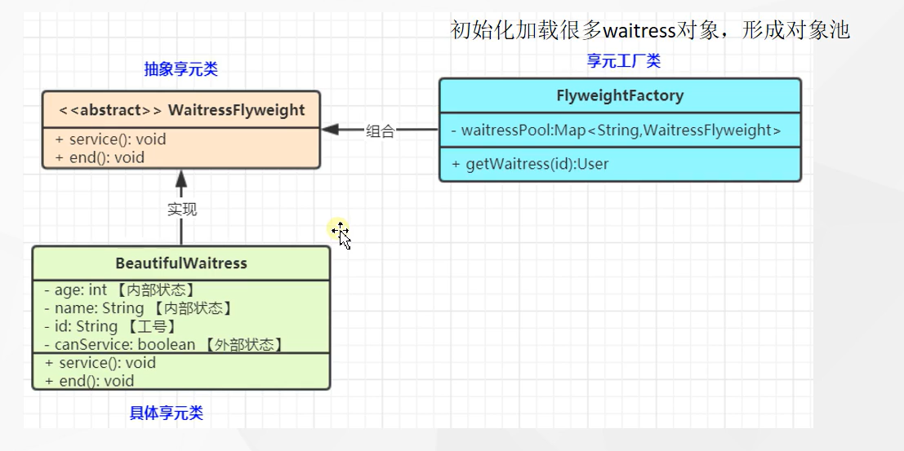

# 享元模式

### 1. 享元模式,运用享元模式有效地支持大量细粒度对象的复用，系统只使用少量的对象，而这些对象都很相似，状态变化小，可以实现对象的多次复用，对象结构型

### 2. 在享元模式中 可以共享的相同内容称为 内部状态，而那些需要外部环境来设置的 不同共享的内容称为外部状态 ，由于区分了内部状态和外部状态，因此可以通过设置不同的外部状态使得相同对象可以具有一些不同的特征，而相同的内部状态是可以共享的

### 3. 在享元模式中通常回出现工厂模式，需要创建一个 享元工厂来负责维护一个 享元池，由于存储具有相同内部状态的享元对象

### 4. 享元模式包含如下角色

#### 4.1 Flyweight: 抽象享元类

#### 4.2 ConcreteFlyweight：具有享元类

#### 4.3 UnsharedConcreteFlyweight: 非共享具体享元类

#### 4.4 FlyweightFactory: 享元工厂类

### 5. 这就是池技术 什么线程池，数据链接池