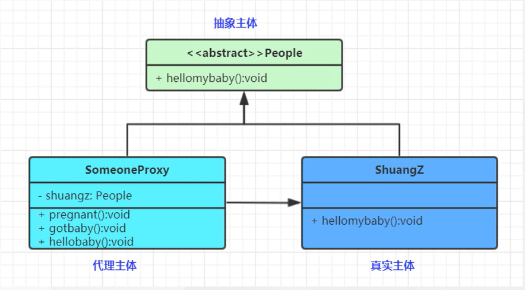

# 代理模式

### 1. 代理模式，给某一个对象提供一个代理，并由代理对象控制对原对象的引用，对象结构型模式

### 2. 一般分为以下几种代理

#### 2.1 静态代理

#### 2.2 动态代理

### 3. 代理模式包含如下角色

#### 3.1 subject：抽象主体角色（抽象类或者接口）

#### 3.2 Proxy：代理主体角色（代理对象类）

#### 3.3 RealSubject： 真实主体角色（被代理对象类）

### 总结： 代理就是 由代理者帮你做事情，你本事不用做事情，代理者有你的所有功能，同步有你没有的功能。