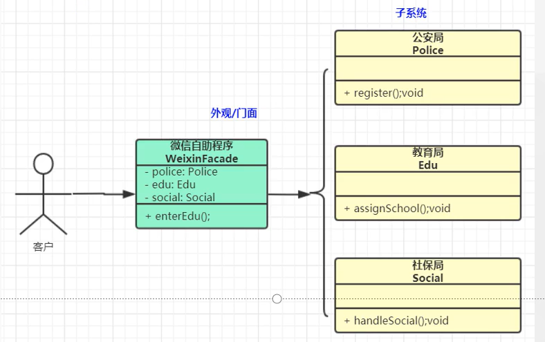

# 外观模式

### 1. 外观模式又叫做 门面模式 ，是一种通过 为多个复杂的子系统提供一个一致的接口，而使这些子系统更加容易被访问的模式

### 2. 什么场景使用？

#### 2.1. 去医院看病，可能要挂号，门诊，取药等 ，让患者或者患者家属觉得复杂，如果有提供接待人员，只让接待人员来处理，就很方便，

#### 2.2. java的三层开发模式

#### 2.3. 分布式系统的网关

#### 2.4 Tomcat源码中的 RequestFacade 干什么的