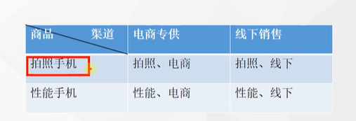

#桥接模式

### 1. 将抽象与实现解耦，使两者都可以独立变化

例子：

在现实生活中，某些类具有两个或者多个维度的变化，如图形即可按形状分，又可俺颜色分。如果设计类似于Photoshop这样的软件，能画不同形状和不同颜色的图形呢？ 如果用继承方式，m种形状和n种颜色的图形就是m * n种，不断对应的子类很多，而且扩展起来困难，不同颜色和字体的文字，不同品牌和功率的汽车

### 2.桥接将继承转为关联，减低类之间的耦合度，减少代码量

### 3.桥接模式包括以下主要角色

1. 系统设计期间，如果这个类里面的一些东西，会扩展很多，这个东西就应该分离出来
2. 抽象化角色：定义抽象类，并包括一个对实现化对象的引用
3. 扩展抽象化角色：是抽象化角色的子类，实现父类种的业务方法，并通过组合关系调用实现化角色种的业务方法
4. 实现化角色：定义实现化角色的接口，供扩展抽象化角色调用