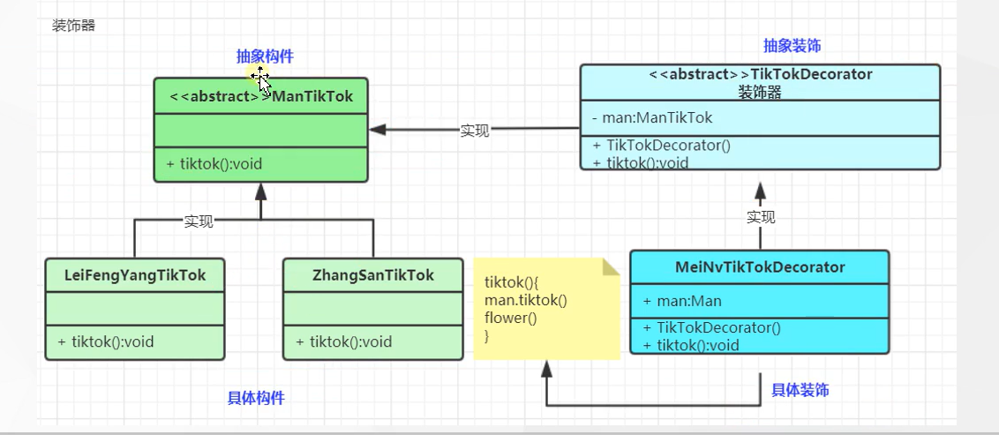

# 装饰器模式

### 1. 向一个现有的对象添加新的功能，同时又不改变其结构，属于对象结构模式

### 2. 创建一个装饰类，用来包装原有的类，并保存类方法签名完整性的前提下，提供额外的功能

### 3. 和适配器很像，但是还是有区别的

适配器：是连接两个类，增强一个类，用白话文说就是 A B两个 业务有的需要调用A 有的要调用B 通过适配器的方式 来获取A 也能获取B

装饰器：是增强一个类,说白了就是增加一个类的功能

