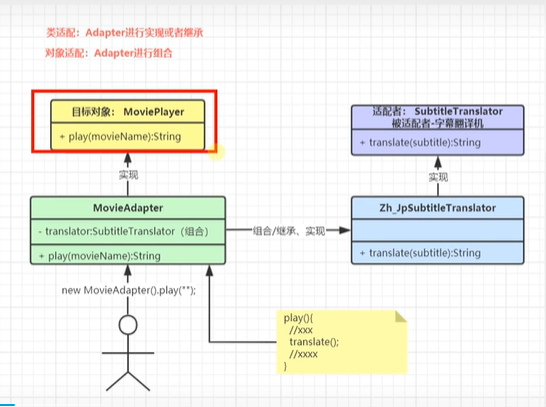

#适配器模式

### 1.将一个接口转换成客户希望的另一个接口,适配器模式使用接口不兼容的那些类可以一起工作，适配器分为类结构模式和对象结构模式两种

### 2.别名为可以Wrapper 包装器

##适配器模式 包含一下主要角色

### 1.目标接口：可以是抽象类或接口，客户希望直接用的接口
### 2.适配者类：隐藏的转换接口
### 3.适配器类：他是一个转换器，通过继承或者引用适配者的对象，把适配者接口转换成目标接口

#备注： 核心就是业务就是 系统本身就有的东西，有需要需要兼容 但是不能改变系统本身的接口，这个时候就可以考虑适配器了