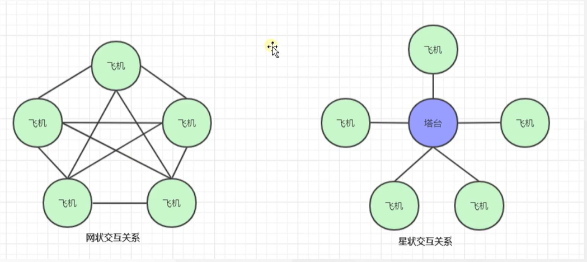
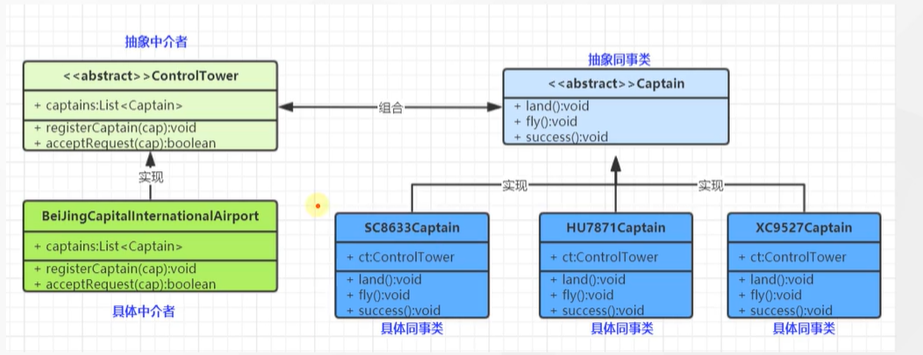

# 中介者模式

### 1.中间者模式：用一个中介对象来封装一系列的对象交互，中间者使各对象不需要显式的相互引用，减少对象见混乱的依赖关系，从而使得其耦合松散，而且可以独立地改变他们之间的交互。 ——对象行为型模式

### 2.中介者角色如下

### 2.1 抽象中介者(Mediator)

### 2.2 具体中介者(ConcreteMediator)

### 2.3 抽象同事类(Colleague)

### 2.4 具体同事类(ConcreteColleague)