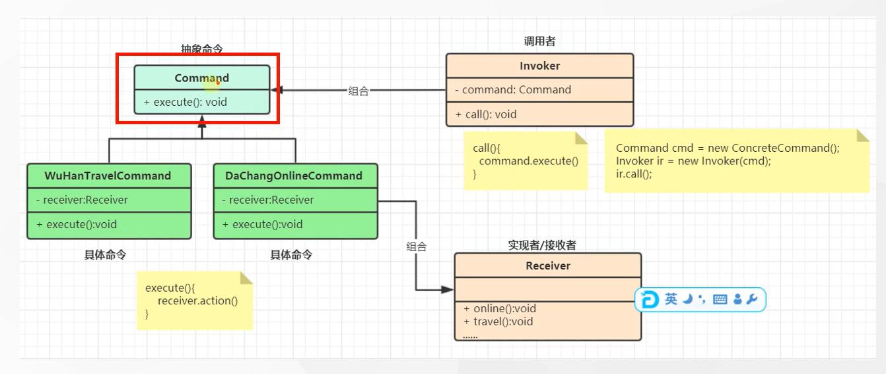

# 命令模式

### 1.命令模式：将一个请求封装为一个对象，使发出请求的责任和执行请求的责任分割开。这样两者之间通过命令对象进行沟通，这样方便将命令对象进行存储、传递、调用、增加与管理

### 2. 命令模式包含角色

####2.1 抽象命令类角色：声明执行命令的接口，拥有执行命令的抽象方法 execute()

#### 2.2 具体命令类角色：是抽象命令类的具体实现类，它拥有接收者对象，并通过调用接收者的功能来完成命令要执行的操作

####2.3 实现者/接收者角色：执行命令功能的相关操作，是具有命令对业务的真正实现者

####2.4 调用者/请求者角色：是请求的发送者，它通常拥有很多的命令对象，并通过访问命令对象来执行相关请求，它不之间访问接收者

### 3.典型的例子 电视 和 遥控器 （封装方法就是命令模式）

