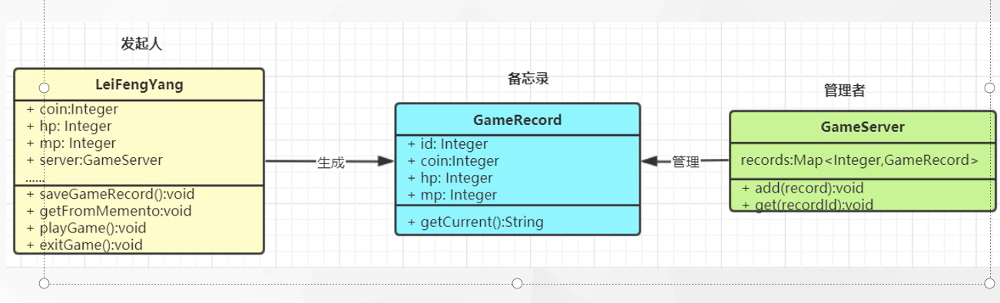

# 备忘录模式

### 1. 备忘录模式：在不破坏封装性的前提下，捕获一个对象的内部状态，并在该对象之外保存这个状态，以便以后当需要时能将对象恢复到原先保存的状态。该模式又叫快照模式。——对象行为模式

### 2.备忘录角色 如下

#### 2.1 发起人角色：记录当前时刻的内部状态信息，提供创建备忘录和恢复备忘录数据的功能，实现其他业务功能，他可以访问备忘录里的所有记录

#### 2.2 备忘录角色：负责存储发起人的内部状态，在需要时候提供这些内部状态给发起人

#### 2.3 管理者角色：对备忘录进行管理，提供保存与获取备忘录的功能，但其不能对被备忘录的内容进行访问与修改