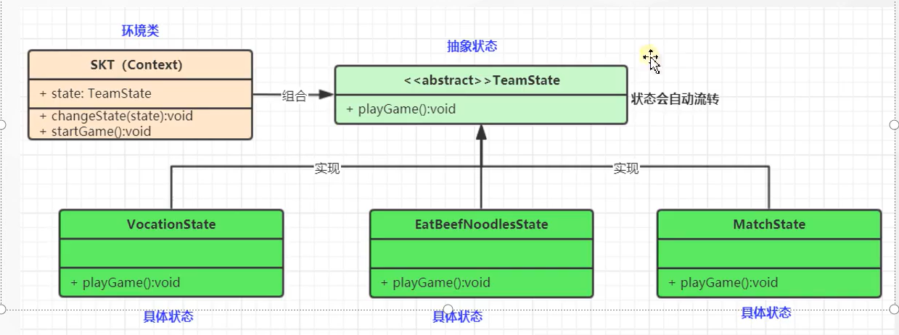

# 状态模式

### 1.状态模式：对有状态的对象，把复杂的”判断逻辑“，提取到不同的状态对象中，允许状态对象在其内部状态发送改变时改变其行为

### 2. 状态模式包含一些模式

#### 2.1 环境类角色：也称为上下文，他定义了客户端需要的接口，内部维护了一个当前状态，并负责具体状态的切换。

#### 2.2 抽象状态角色：定义一个接口，用以封装的环境中的特定状态所对应的行为，可以有一个或多个行为

#### 2.3 具体状态角色：实现抽象状态所对应的行为，并且在需要的情况下进行状态切换

### 3. 状态和策略很像 但是有区别的

#### 3.1 状态的关注点是 状态的流转

#### 3.2 策略的关注点是 每个策略不同的实现 