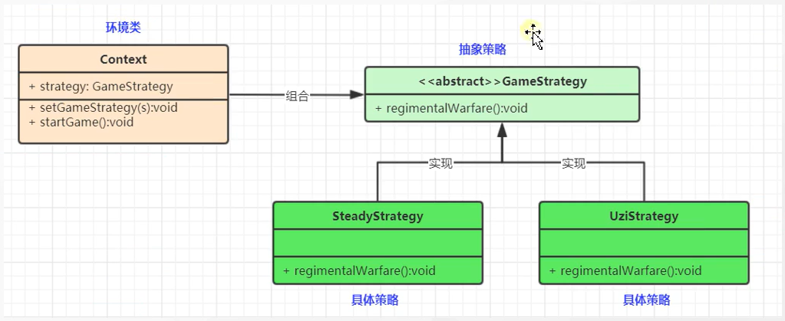

# 策略模式

### 1. 策略模式定义了一系列算法，并将每个算法封装起来，使用他们可以相互替换，且算法的变化不会影响使用算法的客户，属于对象行为模式

### 2. 策略模式主要角色如下

#### 2.1 抽象策略类：公共接口，各种不同的算法以不同的方式实现这个接口，环境角色使用这个接口调用不同的算法，一般使用接口或抽象类实现

#### 2.2 具体策略类：实现了抽象策略定义的接口，提供具体的算法实现

#### 2.3 环境类：持有一个策略类的引用，最终给客户端调用