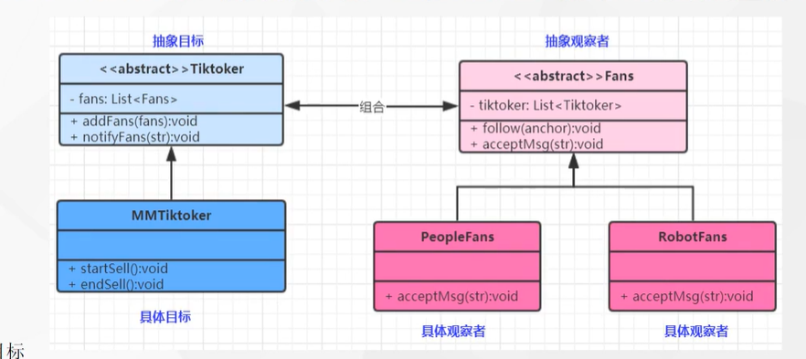
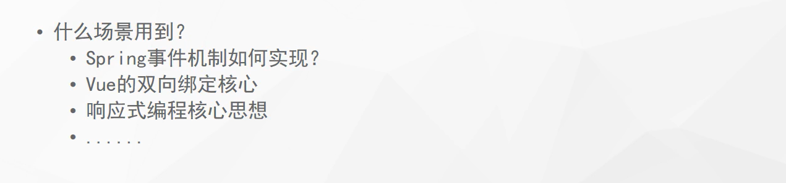

# 观察者模式

### 1. 观察者模式：定义对象间的一种一对多依赖关系，使得每当 一个对象状态发送改变时，其相关依赖对象皆得到通知 并被自动更新。观察者模式又叫做 发布-订阅模式 ——对象行为型模式

### 2. 观察者模式角色分为

#### 2.1 目标(Subject)
#### 2.2 具体目标(ConcreteSubject)
#### 2.3 观察者(Observer)
#### 2.4 具体观察者(ConcreteObserver)

### 3.场景

