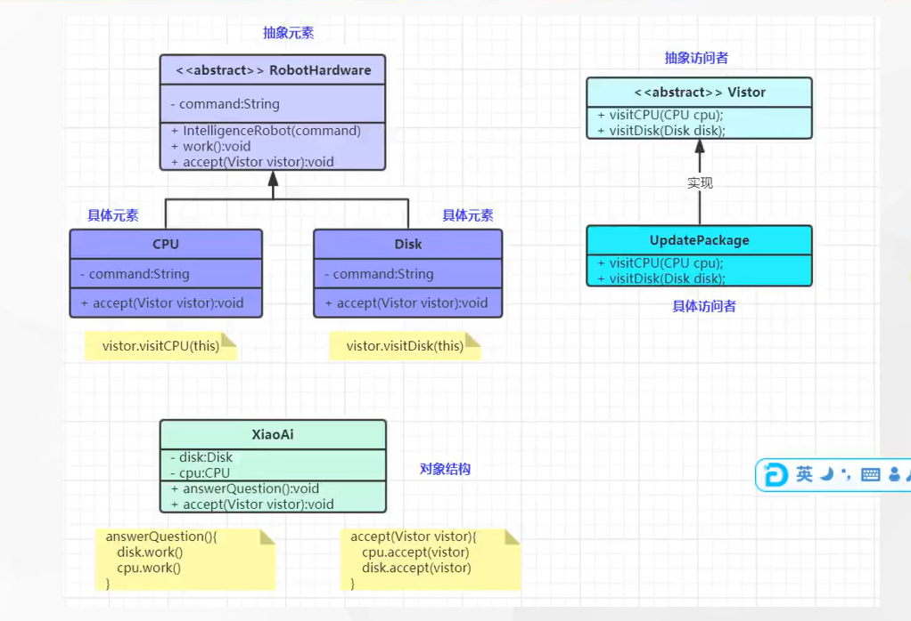

# 访问者模式（很麻烦 应该不会用）

### 1.访问者模式: 将作用于某种数据结构中 各元素 的操作分离出来封装成 独立的类，使其在不改变数据结构的前提下可以添加作用于这些元素的新的操作,为数据结构中的每个元素提供多种访问方式。它将对数据的操作与数据结构进行分离，是行为类模式中 最复杂 的一种模式

### 2.访问者模式角色

#### 2.1 抽象访问者角色：定义个访问绝体元素的接口，为每个具体元素类对应一个访问操作 visit(),该操作中的参数类型标识了被访问的具体元素

#### 2.2 具体访问者角色：实现抽象访问者角色中声明的各种访问操作，确定访问者访问一下元素时该做什么

#### 2.3 抽象元素角色：声明一个包含接受操作 accept()的操作，被接口的访问者对象作为accept()方法的参数

#### 2.4 具体元素角色：实现抽象元素角色提供的accept()操作，其方法体通常都是 visitor.visit(this),另外具体元素中可能还包含本身业务逻辑的相关操作

#### 2.5 对象结构角色：是一个包含元素角色的容器，提供让访问者对象遍历容器中的所有元素的方式，通常由List，Set,Map等聚合类实现