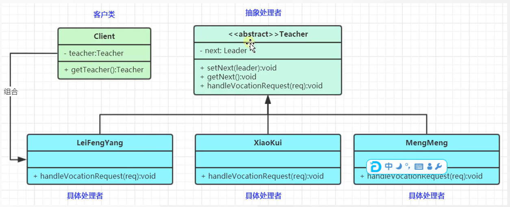

# 责任链模式

###1. 责任链模式：为了避免请求发送者与多个请求处理者耦合在一起，于是将所有请求的处理者通过前一对象记住其下一个对象的引用而连成一条链；当由请求发送时，可将请求沿着这条链路传递，直到有对象处理它为止。 ——属于对象行为模式

###2. 责任链模式角色如下

####2.1 抽象处理者角色：定义一个处理请求的接口，包括抽象处理方法和一个后续链接

####2.2 具体处理者角色；实现抽象处理者的处理方法，判断能否处理本次请求，如果可以处理请求则处理，否则将改请求转给它的后继者

####2.3 客户类角色：创建处理链，并向链头的具体处理者对象提交请求，它不关心处理细节和请求的传递过程。