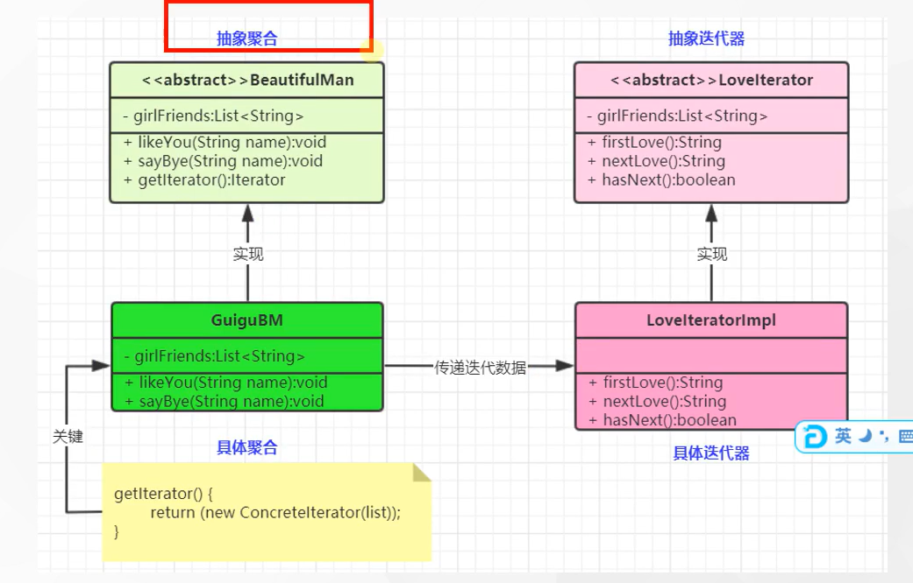

#迭代器模式

### 1.迭代器模式：提供一个对象来顺序访问聚合对象中的一系列数据，而不暴露聚合对象的内部标识——对象行为型模式

### 2. 迭代器模式包含

####2.1 抽象聚合角色：定义存储、添加、删除聚合对象以及创建迭代器对象的接口

####2.2 具体聚合角色：实现抽象聚合类，返回一个具体迭代器的实例

####2.3 抽象迭代器角色：定义访问和遍历觉和元素接口，通常包含 hasNext(), first(),next()等方法

#### 2.4具体迭代器角色：实现抽象迭代器接口中所定义的方法，完成对聚合对象的遍历，记录遍历的当前位置